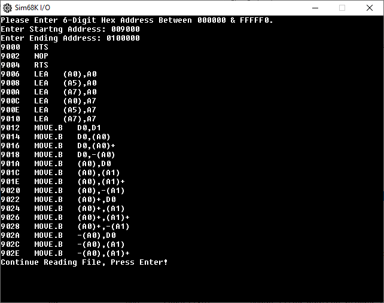
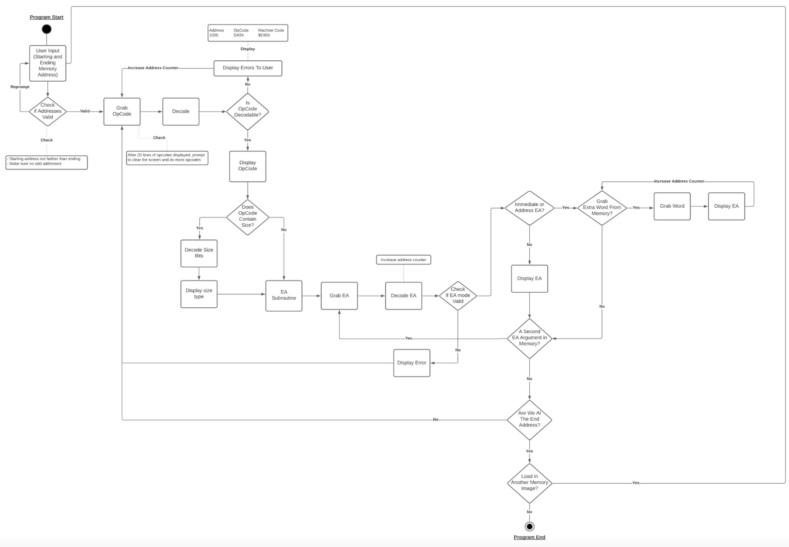
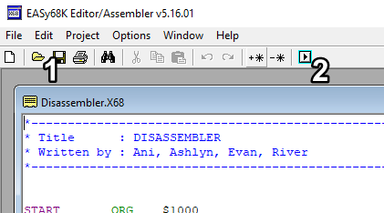
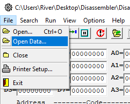
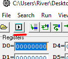
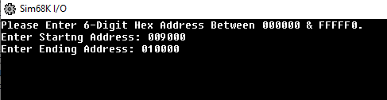

# Disassembler
Created for CSS 422: Hardware And Computer Organization

This disassembler will translate machine code back into assembly language

## Disassembler flowchart

## Running the disassembler in [EASy68k](http://www.easy68k.com/)
1. Open Disassembler.X68 in EASy68k then press the Assemble Source button

2. In the new window load in the demo_testALLVALID.S68 data

- This demo program will be loaded in starting at memory address $00009000

3. Run the disassembler by pressing the Assemble Source button on the new window

4. Enter a starting and ending address

 - For this demo file enter 009000 and 010000
 
 
 
 - The disassembler will now read from memory translate the machine code back into assembly
 
 
